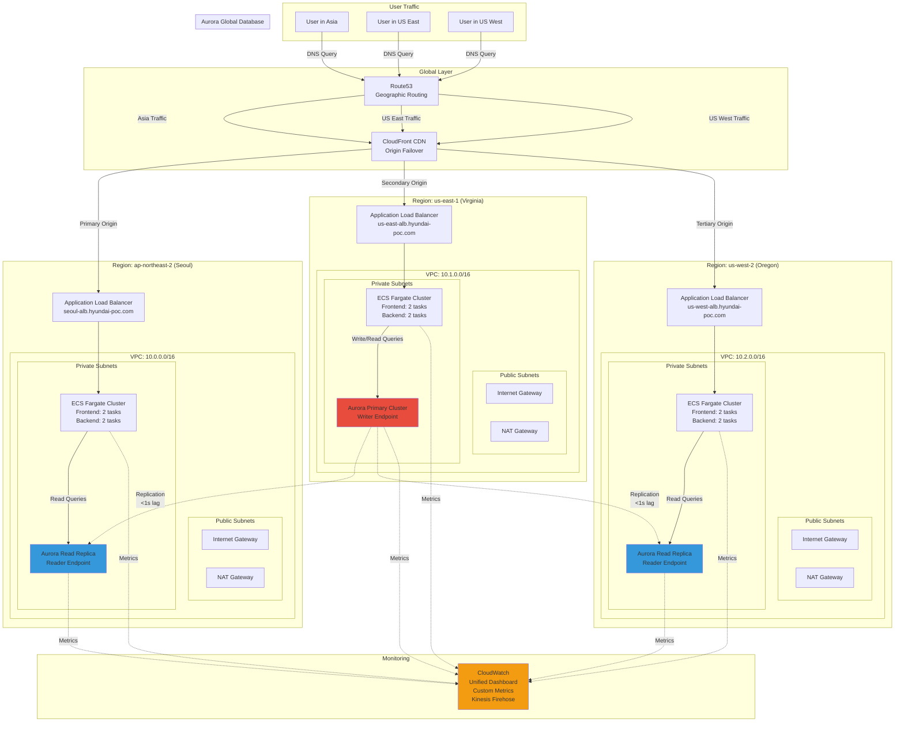

# Hyundai Motors Infrastructure POC

Multi-region AWS infrastructure demonstration featuring Aurora Global Database, ECS Fargate containers, and Route53 geographic routing across 3 regions (Seoul, US-East, US-West).

## Table of Contents

- [Architecture Overview](#architecture-overview)
- [Architecture Diagram](#architecture-diagram)
- [Prerequisites](#prerequisites)
- [Quick Start](#quick-start)
- [Project Structure](#project-structure)
- [Cost Breakdown](#cost-breakdown)
- [Performance Metrics](#performance-metrics)
- [Verification and Testing](#verification-and-testing)
- [Teardown](#teardown)
- [Resources](#resources)

## Architecture Overview

This POC demonstrates Scenario B (Container Architecture) from the Hyundai Motors job assignment with:

- **Aurora Serverless v2 Global Database** - Primary writer in us-east-1, read replicas in Seoul and US-West with <1s replication lag
- **ECS Fargate** - Containerized Next.js frontend and Node.js backend in all 3 regions (12 tasks total)
- **Application Load Balancers** - Regional ALBs with health checks and target group monitoring
- **Route53 Geographic Routing** - Directs traffic to nearest region based on user location
- **CloudFront** - Global CDN with origin failover for high availability
- **CloudWatch Monitoring** - Unified dashboard with metrics from all regions, custom application metrics

### Regions

- **ap-northeast-2 (Seoul)** - Secondary region with Aurora read replica for Asian traffic
- **us-east-1 (Virginia)** - Primary region with Aurora writer endpoint
- **us-west-2 (Oregon)** - Secondary region with Aurora read replica for US West Coast traffic

## Architecture Diagram



### Traffic Flow

1. **User Request** - User in Asia/US makes request to hyundai-poc.com
2. **DNS Resolution** - Route53 resolves to nearest CloudFront edge location based on geolocation
3. **CDN Layer** - CloudFront routes to primary regional ALB (with failover to secondary origins)
4. **Load Balancing** - ALB distributes traffic to healthy ECS Fargate tasks
5. **Application** - Backend queries Aurora (writer for writes, local reader for reads)
6. **Database Replication** - Aurora Global Database replicates changes across regions (<1s lag)
7. **Monitoring** - All components stream metrics to CloudWatch for unified observability

## Prerequisites

- **AWS Account** with appropriate permissions (EC2, ECS, RDS, Route53, CloudWatch, IAM)
- **AWS CLI** v2.x configured with credentials
- **Terraform** >= 1.0
- **Docker Desktop** (for building container images)
- **Node.js** >= 20 (for application development)
- **MySQL client** (for database initialization and testing)
- **Git** (for version control)

## Quick Start

**Deployment Dependencies:** VPC → Aurora DB → ECR Repos → Container Images → ECS Services → Route53/CloudFront/Monitoring

Terraform handles the dependency order automatically via `depends_on` blocks. However, **container images must be built and pushed to ECR BEFORE deploying ECS services**.

### 1. Clone Repository

```bash
git clone https://github.com/your-username/hyundai-motors-poc.git
cd hyundai-motors-poc
```

### 2. AWS Setup (Prerequisites)

```bash
# Configure AWS CLI profile with your credentials
./scripts/setup-aws.sh

# Create ECR repositories in all 3 regions
./scripts/create-ecr-repos.sh
```

The setup script will:
- Configure AWS CLI profile named "hyundai-poc"
- Verify access to all 3 regions
- Generate a strong database password
- Store password in AWS Secrets Manager (us-east-1)
- Replicate secret to Seoul and US-West regions

### 3. Build and Push Container Images (Before Terraform)

**IMPORTANT:** Build and push images to ECR BEFORE running Terraform, as ECS task definitions reference these images.

```bash
# Automated script (recommended)
./scripts/build-and-push.sh
```

This script will:
- Build frontend container (Next.js)
- Build backend container (Node.js)
- Login to ECR in all 3 regions
- Tag and push images to Seoul, US-East, and US-West ECRs

<details>
<summary>Manual build and push (alternative)</summary>

```bash
# Get your AWS Account ID
export AWS_ACCOUNT_ID=$(aws sts get-caller-identity --query Account --output text --profile hyundai-poc)

# Build frontend container
cd application/frontend
docker build -t hyundai-poc-frontend:latest .

# Build backend container
cd ../backend
docker build -t hyundai-poc-backend:latest .
cd ../..

# Push to all 3 regional ECR repositories
for region in ap-northeast-2 us-east-1 us-west-2; do
  echo "Pushing images to ECR in $region..."

  # Login to ECR
  aws ecr get-login-password --region $region --profile hyundai-poc | \
    docker login --username AWS --password-stdin ${AWS_ACCOUNT_ID}.dkr.ecr.${region}.amazonaws.com

  # Tag and push frontend
  docker tag hyundai-poc-frontend:latest ${AWS_ACCOUNT_ID}.dkr.ecr.${region}.amazonaws.com/hyundai-poc-frontend:latest
  docker push ${AWS_ACCOUNT_ID}.dkr.ecr.${region}.amazonaws.com/hyundai-poc-frontend:latest

  # Tag and push backend
  docker tag hyundai-poc-backend:latest ${AWS_ACCOUNT_ID}.dkr.ecr.${region}.amazonaws.com/hyundai-poc-backend:latest
  docker push ${AWS_ACCOUNT_ID}.dkr.ecr.${region}.amazonaws.com/hyundai-poc-backend:latest
done
```
</details>

### 4. Terraform Configuration

```bash
cd terraform

# Copy example variables file
cp terraform.tfvars.example terraform.tfvars

# Edit terraform.tfvars with your values:
# - aws_account_id = "123456789012"
# - db_master_password = "password-from-setup-script"
# - project_name = "hyundai-poc"
# - environment = "interview"
```

### 5. Deploy Infrastructure (Single Command)

```bash
# Initialize Terraform (downloads providers and modules)
terraform init

# Review planned changes (verify all 3 regions)
terraform plan -out=tfplan

# Deploy infrastructure (estimated 25-30 minutes)
# Terraform deploys in dependency order:
#   1. VPCs, Security Groups, IAM Roles (parallel across 3 regions)
#   2. Aurora Global Database (primary first, then replicas)
#   3. ALBs (parallel across 3 regions)
#   4. ECS Services (parallel across 3 regions - pulls images from ECR)
#   5. Route53, CloudFront, Monitoring (depends on all previous)
terraform apply tfplan

# Save outputs for later reference
terraform output -json > outputs.json
```

Expected resources created:
- **3 VPCs** with public/private subnets (10.0.0.0/16, 10.1.0.0/16, 10.2.0.0/16)
- **3 NAT Gateways** and Internet Gateways
- **Aurora Global Database** (1 primary writer in us-east-1 + 2 read replicas)
- **3 ECS Fargate clusters** with 4 tasks each (2 frontend + 2 backend per region)
  - **ARM64 architecture** (Graviton2) for 20% cost savings
  - 256 vCPU / 512 MB memory per task
- **3 Application Load Balancers** with health checks
- **Route53 hosted zone** with geolocation routing policies
- **CloudFront distribution** with origin failover (Seoul → US-East → US-West)
- **CloudWatch dashboard** and Kinesis Data Firehose for metrics

### 6. Initialize Database

```bash
# Navigate back to project root
cd ..

# Run database initialization script
./scripts/init-database.sh
```

This creates the `health_checks` table and seeds initial data in the Aurora primary cluster.

### 7. Verify Deployment

```bash
# Run automated verification script
./scripts/verify-deployment.sh
```

This checks:
- ✅ All ECS services are running (2 tasks per service × 2 services × 3 regions = 12 tasks)
- ✅ ALB target groups are healthy
- ✅ Aurora clusters are available (1 primary + 2 replicas)
- ✅ Route53 records are created
- ✅ CloudFront distribution is deployed

### 8. Test Application

```bash
# Test regional endpoints
curl http://$(terraform output -raw -state=terraform/terraform.tfstate alb_dns_names.seoul)/health
curl http://$(terraform output -raw -state=terraform/terraform.tfstate alb_dns_names.us_east)/health
curl http://$(terraform output -raw -state=terraform/terraform.tfstate alb_dns_names.us_west)/health

# Run latency tests
./scripts/test-latency.sh

# Run replication lag tests
./scripts/test-replication.sh

# Run DNS routing tests
./scripts/test-dns.sh
```

## Project Structure

```
hyundai-motors-poc/
├── terraform/
│   ├── main.tf                      # Root configuration with provider setup
│   ├── variables.tf                 # Input variable definitions
│   ├── outputs.tf                   # Output values (ALB URLs, endpoints)
│   ├── terraform.tfvars.example     # Example variable values
│   ├── terraform.tfvars             # Actual values (gitignored)
│   └── modules/
│       ├── vpc/                     # VPC, subnets, NAT, IGW, route tables
│       ├── security-groups/         # ALB, ECS, Aurora security groups
│       ├── iam/                     # IAM roles for ECS tasks and execution
│       ├── aurora/                  # Aurora Global Database clusters
│       ├── alb/                     # Application Load Balancers and target groups
│       ├── ecs/                     # ECS Fargate clusters and service definitions
│       ├── route53/                 # DNS hosted zone and geolocation routing
│       ├── cloudfront/              # CloudFront distribution with origin failover
│       └── monitoring/              # CloudWatch dashboards and Kinesis Firehose
├── application/
│   ├── frontend/                    # Next.js application
│   │   ├── src/
│   │   │   ├── app/                 # App router pages
│   │   │   └── components/          # React components
│   │   ├── Dockerfile               # Multi-stage build
│   │   ├── package.json
│   │   └── README.md
│   └── backend/                     # Node.js Express API
│       ├── src/
│       │   ├── routes/              # API route handlers
│       │   ├── db/                  # Database connection pools
│       │   └── metrics/             # CloudWatch metrics publishing
│       ├── Dockerfile               # Alpine-based image
│       ├── package.json
│       └── README.md
├── scripts/
│   ├── setup-aws.sh                 # AWS CLI profile and Secrets Manager setup
│   ├── create-ecr-repos.sh          # Create ECR repositories in all regions
│   ├── init-database.sh             # Database schema initialization
│   ├── verify-deployment.sh         # Deployment health checks
│   ├── destroy.sh                   # Infrastructure teardown with confirmation
│   ├── test-latency.sh              # Latency measurement tests
│   ├── test-replication.sh          # Aurora replication lag tests
│   └── test-dns.sh                  # Route53 DNS resolution tests
├── docs/
│   ├── interview-talking-points.md  # Prepared answers for interview questions
│   ├── failover-runbook.md          # Step-by-step failover procedure
│   ├── dns-verification.md          # DNS testing methodology
│   └── screenshots/                 # Screenshots for interview backup
│       └── README.md                # Screenshot capture guide
├── test/
│   └── integration/                 # Integration tests
├── .gitignore                       # Exclude tfstate, tfvars, secrets
└── README.md                        # This file

```

## Cost Breakdown

Expected cost for 24-hour interview demonstration:

### Per Region Costs

| Service | Configuration | Hourly | Daily (24h) |
|---------|---------------|--------|-------------|
| **Aurora Serverless v2** | 0.5-2 ACU per cluster | $0.58-2.32 | $13.92-55.68 |
| **ECS Fargate (ARM64)** | 4 tasks (0.25 vCPU, 512 MB each) | $0.13 | $3.12 |
| **NAT Gateway** | 1 gateway + data processing | $0.52 | $12.48 |
| **Application Load Balancer** | Standard ALB | $0.27 | $6.48 |
| **Data Transfer** | Inter-region replication | Variable | $1-3 |
| **Subtotal per region** | | ~$1.50-3.22 | ~$37-81 |

### Total 24-Hour Cost

| Component | Estimated Cost | Notes |
|-----------|----------------|-------|
| Aurora (3 regions) | $20-25 | Serverless v2, 0.5-2 ACU |
| ECS Fargate ARM64 (3 regions) | **$9-10** | **20% savings vs X86** |
| NAT Gateway (3 regions) | $10-15 | Single per region |
| ALB (3 regions) | $5-8 | Standard ALB |
| Route53 + CloudFront | $2-3 | Minimal traffic |
| Data Transfer | $3-5 | Inter-region replication |
| **TOTAL** | **$43-61** | **~$2 saved with ARM64** |

**Target: <$50 USD for interview day** ✅

### Cost Optimization Notes

- **ARM64 (Graviton2)** architecture for ECS Fargate: **20% cost savings**
- Aurora Serverless scales down to 0.5 ACU during idle periods
- Single NAT Gateway per region (multi-AZ for production)
- Minimal ECS task count (2 frontend + 2 backend per region)
- No CloudWatch Logs Insights queries (use basic log viewing)
- Destroy infrastructure immediately after interview with `./scripts/destroy.sh`

## Performance Metrics

### Expected Latency Measurements

Based on AWS inter-region latency benchmarks:

| Source | Destination | Expected Latency | Measured (Update After Deploy) |
|--------|-------------|------------------|--------------------------------|
| Seoul | Seoul | <50ms | TBD |
| Seoul | US-East | 150-200ms | TBD |
| Seoul | US-West | 100-150ms | TBD |
| US-East | US-East | <10ms | TBD |
| US-East | Seoul | 150-200ms | TBD |
| US-East | US-West | 60-80ms | TBD |
| US-West | US-West | <10ms | TBD |
| US-West | Seoul | 100-150ms | TBD |
| US-West | US-East | 60-80ms | TBD |

### Aurora Replication Metrics

| Metric | Target | Measured (Update After Deploy) |
|--------|--------|--------------------------------|
| Replication Lag (P50) | <500ms | TBD |
| Replication Lag (P95) | <1000ms | TBD |
| Replication Lag (P99) | <2000ms | TBD |
| Query Response Time | <100ms | TBD |

### Application Performance

| Metric | Target | Measured (Update After Deploy) |
|--------|--------|--------------------------------|
| Frontend Page Load | <2s | TBD |
| API Response Time (P95) | <500ms | TBD |
| Health Check Response | <100ms | TBD |

## Verification and Testing

### Automated Verification

```bash
# Run comprehensive deployment verification
./scripts/verify-deployment.sh
```

Checks performed:
- ECS service status (all tasks running)
- ALB target health (all targets healthy)
- Aurora cluster status (all clusters available)
- Route53 DNS records (geolocation routing configured)
- CloudFront distribution (deployed and enabled)

### Manual Testing

```bash
# Test latency to all regions
./scripts/test-latency.sh

# Test Aurora replication lag
./scripts/test-replication.sh

# Test DNS resolution from different locations
./scripts/test-dns.sh
```

### Access Dashboard

After deployment, access the application:

```bash
# Get CloudFront URL
terraform output cloudfront_url

# Get regional ALB URLs
terraform output regional_endpoints

# Get CloudWatch dashboard URL
terraform output cloudwatch_dashboard_url
```

## Database Schema

Simple schema for POC demonstration:

```sql
CREATE TABLE health_checks (
  id BIGINT AUTO_INCREMENT PRIMARY KEY,
  region VARCHAR(20) NOT NULL,
  timestamp TIMESTAMP DEFAULT CURRENT_TIMESTAMP,
  replication_lag_ms INT,
  INDEX idx_timestamp (timestamp),
  INDEX idx_region (region)
);
```

## Teardown

To destroy all infrastructure and avoid ongoing charges:

```bash
# Run automated teardown script (includes confirmation prompt)
./scripts/destroy.sh
```

The script will:
1. Display warning and request confirmation
2. Run `terraform destroy -auto-approve`
3. Verify all resources are deleted
4. Check for zero recurring charges

Manual teardown:

```bash
cd terraform
terraform destroy -auto-approve
```

**Note:** Aurora cluster deletion may take 5-10 minutes. Verify deletion in AWS Console.

### Post-Teardown Checklist

- [ ] All ECS services deleted
- [ ] All Aurora clusters deleted
- [ ] All VPCs and subnets deleted
- [ ] All NAT Gateways deleted
- [ ] All ALBs deleted
- [ ] Route53 records deleted
- [ ] CloudFront distribution disabled
- [ ] ECR images deleted (manual)
- [ ] Secrets Manager secrets deleted (manual)
- [ ] CloudWatch log groups deleted (manual, optional)

## Resources

### Documentation

- [Architecture Diagram](#architecture-diagram) - Mermaid diagram in this README
- [Interview Talking Points](docs/interview-talking-points.md) - Prepared answers with POC metrics
- [Failover Runbook](docs/failover-runbook.md) - Manual failover procedure
- [DNS Verification](docs/dns-verification.md) - DNS testing methodology
- [Screenshots Guide](docs/screenshots/README.md) - What to capture for interview

### CloudWatch Dashboard

Access unified monitoring dashboard:
```bash
terraform output cloudwatch_dashboard_url
```

### Application Endpoints

- **CloudFront URL**: `https://[distribution-id].cloudfront.net`
- **Seoul ALB**: `http://seoul-alb-[hash].ap-northeast-2.elb.amazonaws.com`
- **US-East ALB**: `http://us-east-alb-[hash].us-east-1.elb.amazonaws.com`
- **US-West ALB**: `http://us-west-alb-[hash].us-west-2.elb.amazonaws.com`

### API Endpoints

- `GET /health` - Service health check
- `GET /db-health` - Database connectivity check
- `GET /metrics` - Infrastructure and application metrics
- `GET /metrics/latency` - Cross-region latency measurements
- `POST /test-write` - Test database write and replication

## Interview Preparation

### Quick Demo Flow

1. **Show Architecture** - Display Mermaid diagram and explain multi-region design
2. **Show Live Dashboard** - Open frontend showing real-time latency and replication lag
3. **Test Geographic Routing** - Use VPN to access from different regions
4. **Show CloudWatch Metrics** - Display unified monitoring dashboard
5. **Explain Failover** - Walk through documented runbook
6. **Discuss Costs** - Show actual AWS billing (should be <$50)

### Key Talking Points

Prepared answers in [docs/interview-talking-points.md](docs/interview-talking-points.md):

- Why Aurora vs RDS?
- How does geographic routing work?
- What's your disaster recovery strategy?
- How would you optimize costs?
- What would you add for production?

All answers backed by actual POC metrics and implementation.

## License

This is a proof-of-concept project for interview purposes.
